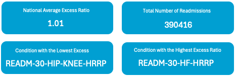
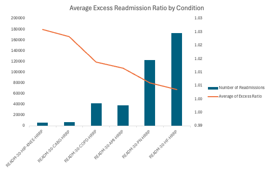
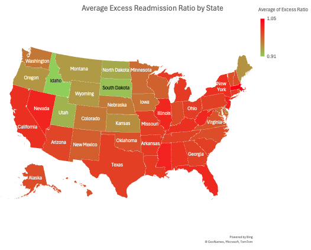
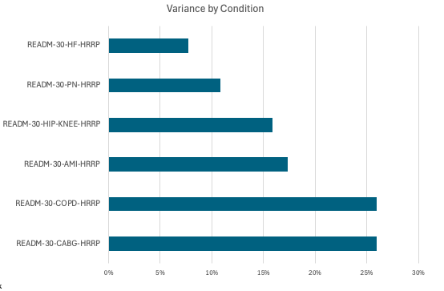

# Hospital Readmission Analysis
## Overview:
This project analyzes U.S. hospital readmission rates to identify trends and key drivers impacting healthcare costs and patient outcomes. Using publicly available datasets, I explored how different conditions, hospital performance, and geography contribute to readmissions.

### Key Skills Demonstrated:
* Data cleaning and transformation in Power Query
* Advanced Excel analysis and presentation - pivot tables, KPIs, charts
* Business insights and storytelling for healthcare management

## Dataset
* Source: (Medicare Hospital Readmission Reduction Program) - https://data.cms.gov/provider-data/dataset/9n3s-kdb3
* Size: ~5,000 hospitals
* Variables: Hospital ID, condition-specific readmission rates, state, penalties, etc.

## Questions Explored
1. Which conditions have the highest readmission rates nationally?
2. Are there geographic patterns in readmission rates?
3. How do hospital penalties correlate with readmission performance?
4. What insights can support reducing costs and improving patient outcomes?

## Tools Used
* Excel (Pivot tables, KPIs, visualizations)
* Power Query (data cleaning & transformations)
* GitHub (project documentation)
## Results (Preview)

---
### Hospital Readmissions Reduction Program (HRRP) Measures
| **Code**                | **Condition / Procedure**                       | **Description**                                              |
|-------------------------|-----------------------------------------------|--------------------------------------------------------------|
| **READM-30-CABG-HRRP**  | Coronary Artery Bypass Graft (CABG)           | 30-day unplanned readmission after CABG surgery              |
| **READM-30-COPD-HRRP**  | Chronic Obstructive Pulmonary Disease (COPD)  | 30-day readmission after hospitalization for COPD            |
| **READM-30-AMI-HRRP**   | Acute Myocardial Infarction (Heart Attack)    | 30-day readmission after hospitalization for heart attack    |
| **READM-30-HIP-KNEE-HRRP** | Hip and Knee Replacement (Elective)        | 30-day readmission after hip or knee replacement surgery     |
| **READM-30-PN-HRRP**    | Pneumonia (PN)                                | 30-day readmission after treatment for pneumonia             |
| **READM-30-HF-HRRP**    | Heart Failure (HF)                            | 30-day readmission after hospitalization for heart failure   |

---

### Key Performance Indicators

- Avg Excess Readmission Ratio: **1.01**
- Total Readmissions: **390,000+**
- Highest Ratio Condition: **Heart Failure**
- Lowest Ratio Condition: **Joint Replacement**

---

### Excess Ratio by Condition
 
Heart Failure and Pneumonia have the highest excess readmissions, indicating target areas for improvement and cost risk reduction.

---

### State-Level Readmission Patterns
 
States in the Southeast and Midwest show higher average excess ratios, with some variation likely tied to hospital capacity and condition-specific performance.

---

### Variance: Predicted vs Expected Rates
 
Chronic Obstructive Pulmonary Disease (COPD) and Coronary Artery Bypass Graft (CABG) procedures show the largest predicted-over-expected variance, suggesting systemic underperformance relative to CMS benchmarks.

---

## Conclusion

This analysis highlights how even small improvements in hospital readmission rates can have a significant financial and operational impact. Conditions like **Heart Failure**, **Pneumonia**, and **COPD** consistently show higher-than-expected readmissions, suggesting a need for focused intervention strategies. State-level patterns also reveal **regional disparities**, underscoring the importance of benchmarking and tailored resource allocation.

By leveraging Excel and Power Query, I was able to transform raw CMS data into actionable insights that hospital administrators, healthcare consultants, or public policy analysts could use to inform strategic decisions.

This project demonstrates not just technical skills in data preparation and visualization, but also the ability to frame healthcare performance challenges in a way that supports real-world improvements.

---
## What I Learned

This project sharpened my ability to work with large, real-world healthcare datasets and transform them into insights that matter. Specifically, I:

- Practiced **data cleaning and transformation** using Power Query, including filtering, renaming, and creating calculated fields.
- Used **Excel PivotTables and charts** to explore key performance metrics like excess readmission ratios, predicted vs. expected outcomes, and geographic trends.
- Designed **KPI cards and comparative visuals** to highlight high-risk conditions and underperforming regions.
- Strengthened my ability to **translate raw data into actionable business insights**, especially in the context of cost management and quality improvement in healthcare.
- Developed a more intuitive sense for **data storytelling**—from understanding the problem to structuring analysis, and finally visualizing outcomes clearly for decision-makers.

This project also reinforced the importance of reproducibility and version control using GitHub, laying the groundwork for deeper analytics and dashboarding projects going forward.

---
Thanks for reading,
FJR
